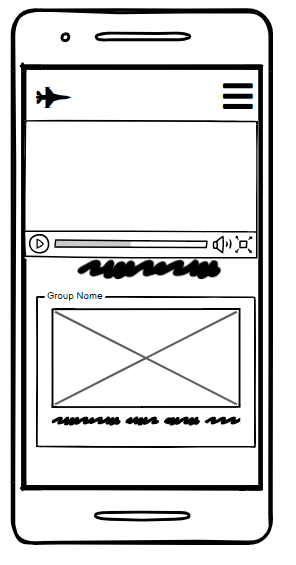
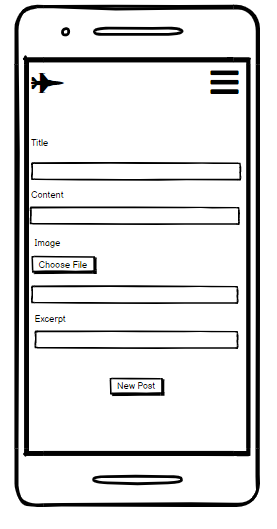
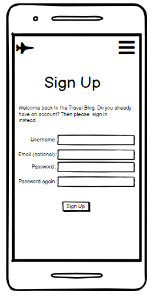
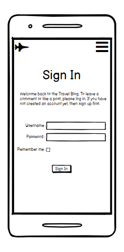
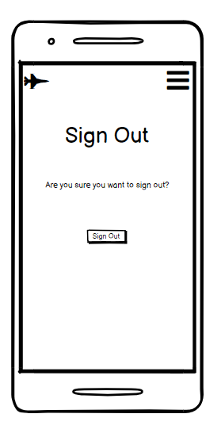
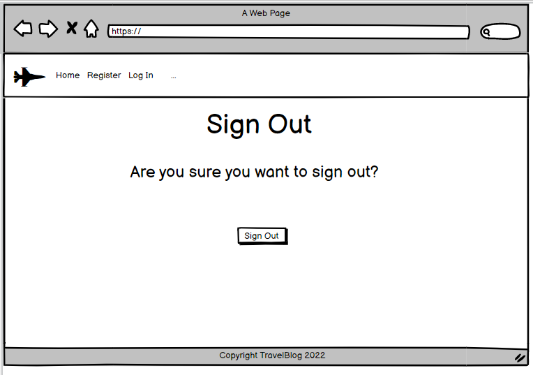
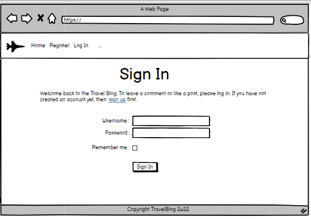
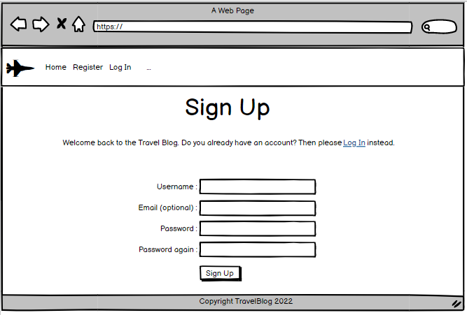
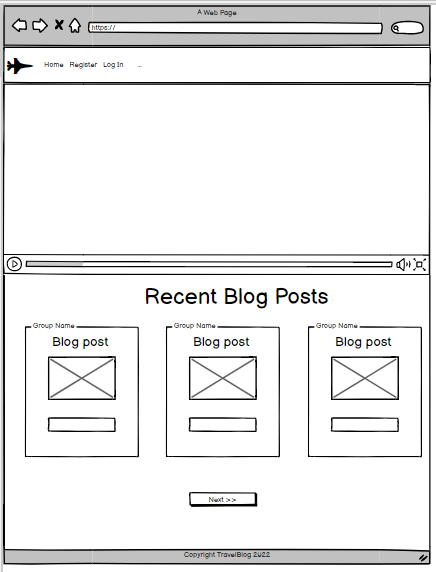
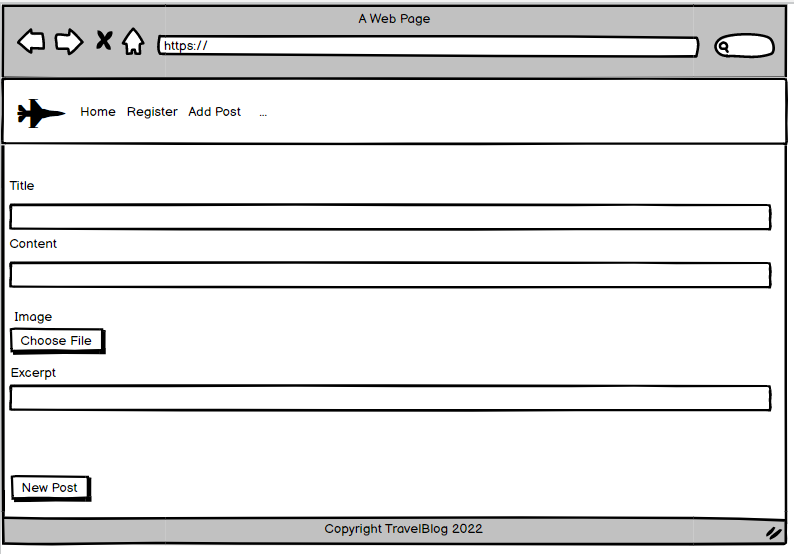

# Table of Contents

- [Table of Contents](#table-of-contents)
  - [Introduction](#introduction)
  - [UX](#ux)
    - [User Stories](#user-stories)
    - [Strategy](#strategy)
    - [Scope](#scope)
    - [Features](#features)
      - [Existing Features](#existing-features)
      - [Homepage](#homepage)
      - [Navbar](#navbar)
      - [Login](#login)
      - [Logout](#logout)
      - [Posts](#posts)
      - [Register as a user](#register-as-a-user)
      - [Upload New post](#upload-new-post)
      - [Update a post](#update-a-post)
      - [Comments](#comments)
      - [Site Admin Panel](#site-admin-panel)
      - [Footer](#footer)
    - [Structure](#structure)
    - [Skeleton](#skeleton)
      - [Whireframes](#whireframes)
      - [Mobile](#mobile)
      - [Desktop](#desktop)
      - [Technology Used](#technology-used)
        - [Progamming Languages .....](#progamming-languages-)
      - [Frameworks, Libraries \& Programs Used](#frameworks-libraries--programs-used)
    - [Testing](#testing)
      - [Functionality Testing](#functionality-testing)
    - [Bugs found on PEP8](#bugs-found-on-pep8)
    - [Deployment](#deployment)
    - [Credits](#credits)
      - [Media](#media)
      - [Code](#code)

    

**[LIVE DEMO - Click & Play ](https://8000-mariusbujor-travelblog-6fyxazwdtxn.ws-eu46.gitpod.io/)**

![]

  ## Introduction
  This is a community Travel Blog website for anyone who love to travel around the world and share their fabulous stories and photos of places that they recommend to go to. 

  ## UX
  ### User Stories 
  - As a site User I can : 
    - register an account so that I can comment and interact with the posts
    - be involved in the conversation when I leave comments on posts
    - read full text when I am pressing on post
    - select one post from the list with all posts
    - unlike or like a post and intereact with the 
    - view a paginated list of posts so that easily select a post to view
    - update my profile so that other users can view my details
    - create draft posts and writing the content later
    - make changes to the post by editing the post
    - remove / delete my post if I want
    - remove / delete a comments from posts if I want
    - upload photos to my posts
  - As a site Admin I can : 
    - edit posts so that I can make changes to the post
    - filter, approve or disapprove comments
    - manage my blog content by creating ,reading,updating and deleting posts
    - manage and interact with the blog content as a superuser 
  - As a User/Admin I can :
    - read conversations and view comments on individual post
    - view the number of likes on individual post and see which is the most popular
  

  ### Strategy 

  - This is a website where users that love to travel can share photos and stories : 
   - users that want to travel
   - users that traveld already
  
  ### Scope 

  - The website provides for the user an easy navigation , photos and content with regards to location from the photos.

  ### Features

  
  #### Existing Features

  #### Homepage 

  - Hompage displays the Navbar and logo, posts with description and footer with social network links.
  
     [Hompage - photo 1](screenshot/home_page1.PNG)

     [Hompage - photo 2](screenshot/home_page2.PNG)

  #### Navbar

  - In loading mode Navar displays : Home, Register and Login

     [Navbar Logged Out - photo ](screenshot/navbar_1.PNG)

  - In user logged mode Navar displays : Home, Logou and Add Post

     [Navbar Logged In - photo ](screenshot/navbar_2.PNG)

  #### Login

  - When a user presse the Login link a new section will apear at the bottom of the page where he can insert his  account details.
  
     [Sign In - photo ](screenshot/sign_in.PNG)

  #### Logout

  - When a user presse the Logout link a new section will apear at the bottom of the page where he is asked to confirm his action by pressing the Sign Out button .

     [Sign Out - photo ](screenshot/sign_out.PNG)

  #### Posts

  - There are 6 post with short content  displayed on the home page 
  - When users are adding more posts a new page will be available by pressin the Next button at the bottom of the page.

     [Blog Cards - photo ](screenshot/blog_cards.PNG)

  #### Register as a user

  - When a user presses the Register link a new section will apear at the bottom of the page where is asked to introduce their ditails.

     [Register as user - photo ](screenshot/register.PNG)

  #### Upload New post

  - When a user decide to upload a new post with content and press the New post link a a new section will apear at the bottom of the page where is asked to introduce the conntent , to upload a photo and press the New Post button to send the post to be apprved by the admin.

     [Upload new post - photo ](screenshot/new_post.PNG)

  #### Update a post

  - When a user decide to update a post uploaded by himself and press the choosen post a new  page will apear where is asked to choose to update or delete the post.

     [Update a post - photo ](screenshot/update_post.PNG)

  #### Comments

  - When a user decide to comment a post and press the choosen post a new page will apear where has only the option to add a comment to the post.

     [Comments section - photo ](screenshot/comments.PNG)

  #### Site Admin Panel

  - As a site Admin : 
    - I can aprrove or dissaprove comments or post.
    - I can create drafts and continue to add content later to the posts
    - I can edit and make changes to posts

     [Admin page - photo ](screenshot/admin.PNG)

  #### Footer

  - The footer shows the social network links and Copy Rights 
  
     [Footer - photo ](screenshot/footer.)

  ### Structure

  - Navbar is fixed on top to facilitate users to scroll the page 
  and  also have the posobility to access the links in the navbar
  - On small screens  a dropdown menu navigation will be available on all pages
  - The pages have a straightforword layout in place to ensure users can navigate easly.

  ### Skeleton
  - Wireframes created with Balsamiq
  - The project was developed from initial wireframes, and some modifications were made during the development process in response to user feedback.

  #### Whireframes

  

  
Click to see the Wireframes

  #### Mobile

  

  

  

  

  

  #### Desktop

  

  

  

  
  
  

  

  
  #### Technology Used

  ##### Progamming Languages .....

  - Python
  - HTML
  - CSS
  - JavaScript
  
  #### Frameworks, Libraries & Programs Used

  - [Balsamiq](https://balsamiq.cloud/) - Was used to create the wireframes
  - [Bootstrap](https://getbootstrap.com/) - Was used to contribute to responsiveness and styling of the site
  - [TinyJPG](https://tinyjpg.com/) - Was used to compress images before uploading
  - [GitHub](https://github.com/) - Holds the repository of my project, GitHub connects to GitPod and Heroku
  - [GitPod](https://gitpod.io/) - Connected to GitHub, GitPod hosted the coding space,
   allowing the project to be built and then committed to the GitHub repository.
  - [Heroku](https://heroku.com/) - Connected to the GitHub repository, Heroku is a cloud application platform used 
   to deploy this project so the backend language can be utilised/tested.
  - [Django](https://www.djangoproject.com/) - This framework was used to build the foundations of this project
  - [Gunicorn](https://gunicorn.org/) - Gunicorn is a pure-Python HTTP server for WSGI applications.
  - [DjDatabaseURL](https://pypi.org/project/dj-database-url/) - This allows you to utilize the 12factor inspired DATABASE_URL 
   environment variable to configure your Django application.
  - [Cloudinary](https://cloudinary.com/) - Used to store images online for the recipe posts.
  - [Summernote](https://summernote.org/) - Used to add a text area field to the admin setup to enable 
   a list of ingredients and method steps.
  - [GoogleFonts](https://fonts.google.com/) - Provide fonts for the website.
  - [FontAwesome](https://fontawesome.com/) - Was used for icons.
  - [AmIResponsive](https://ui.dev/amiresponsive) - To check if the site is responsive on different screen sizes.
  - [Pixabay](https://pixabay.com/) and [Pexel](https://www.pexels.com/) - Were used for all the images.
  - [W3CMarkupValidator](https://jigsaw.w3.org/) - Was used to validate HTML.
  - [Coolors](https://coolors.co/) - To make color palette

  ### Testing
  #### Functionality Testing 
  ### Bugs found on PEP8
  ### Deployment

  
  ### Credits
  #### Media
  #### Code

  
     

